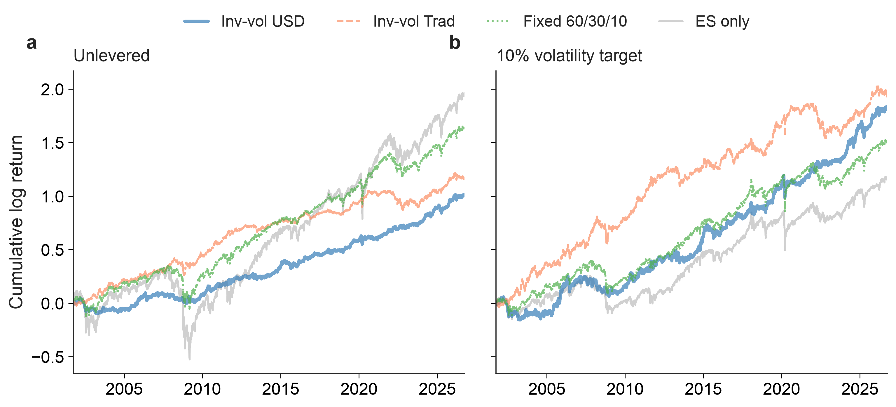
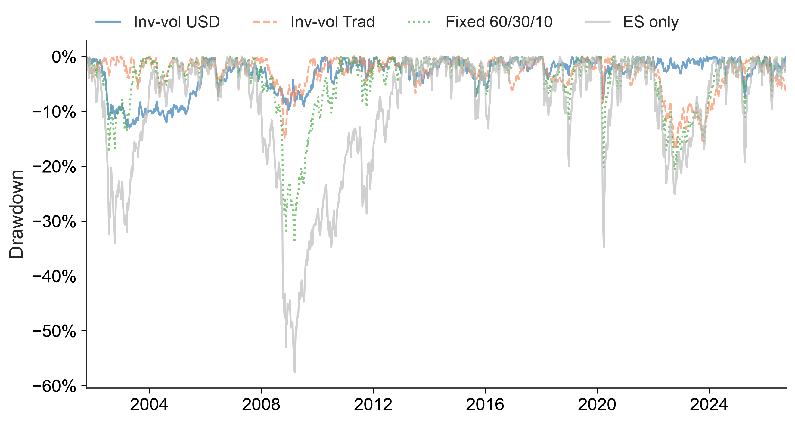
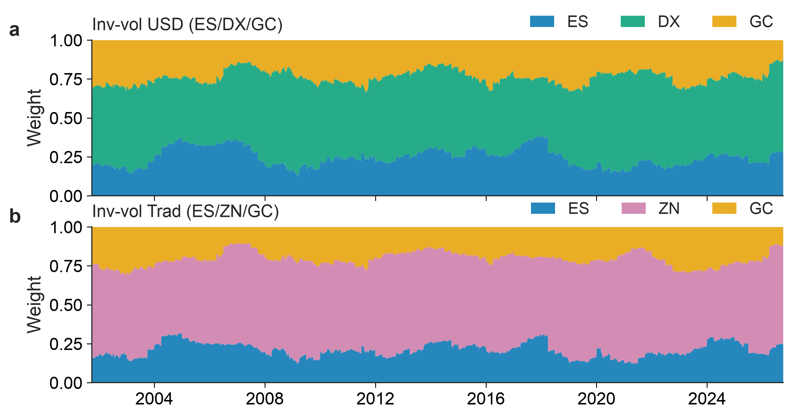
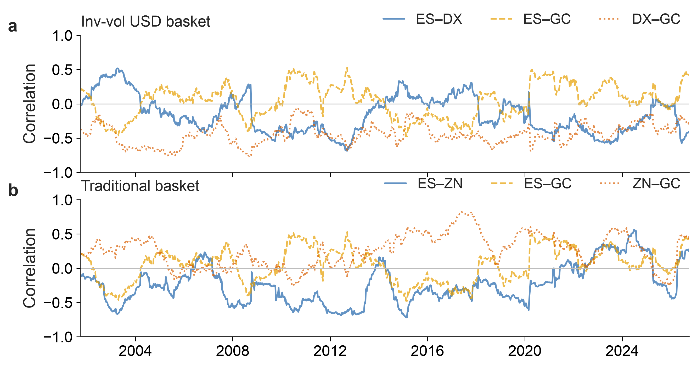
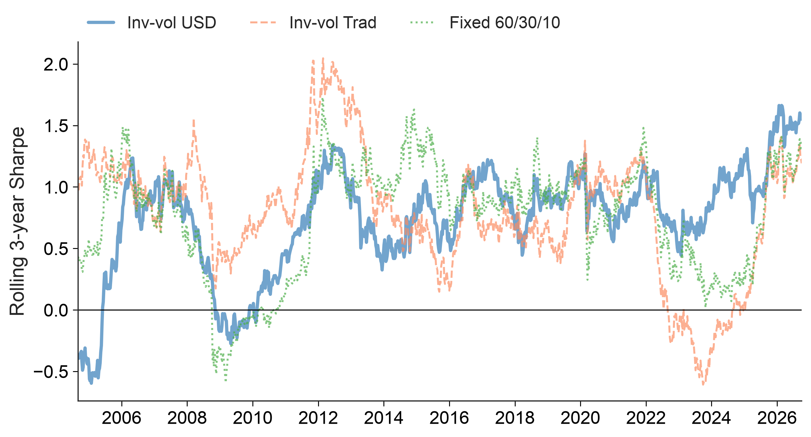
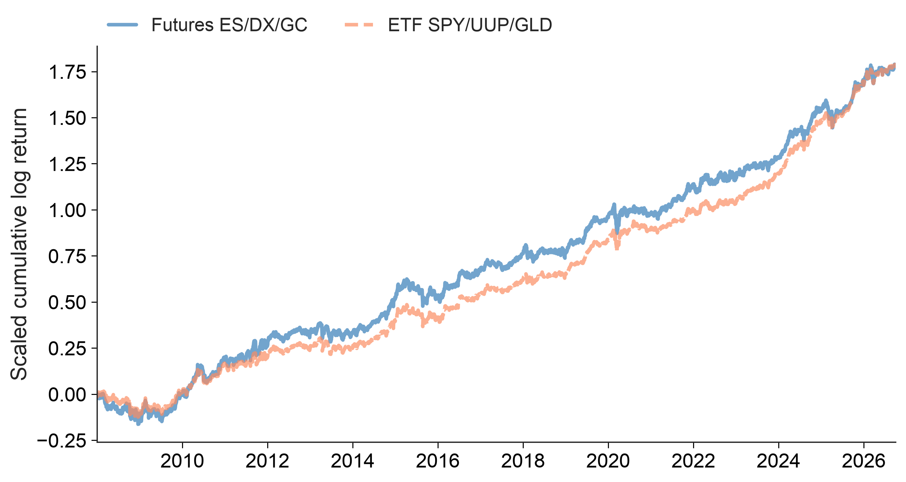
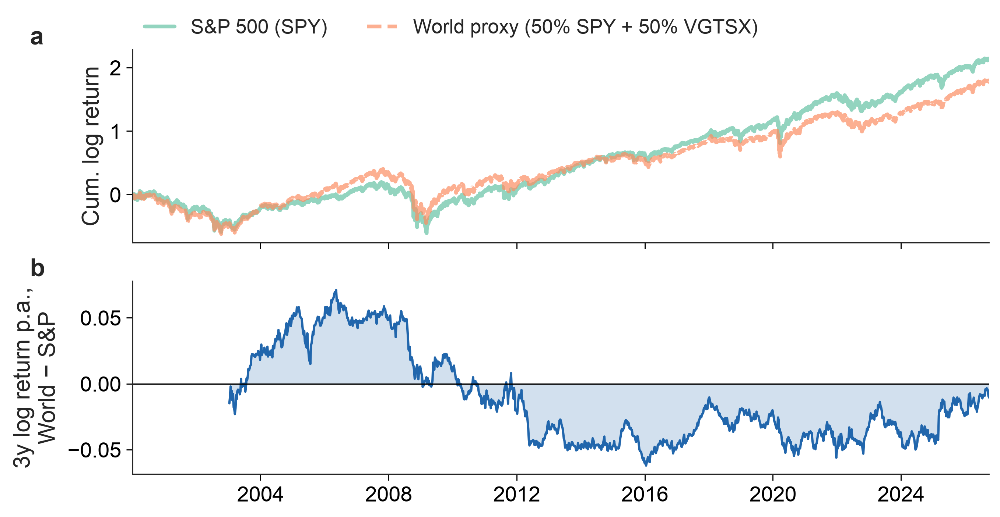
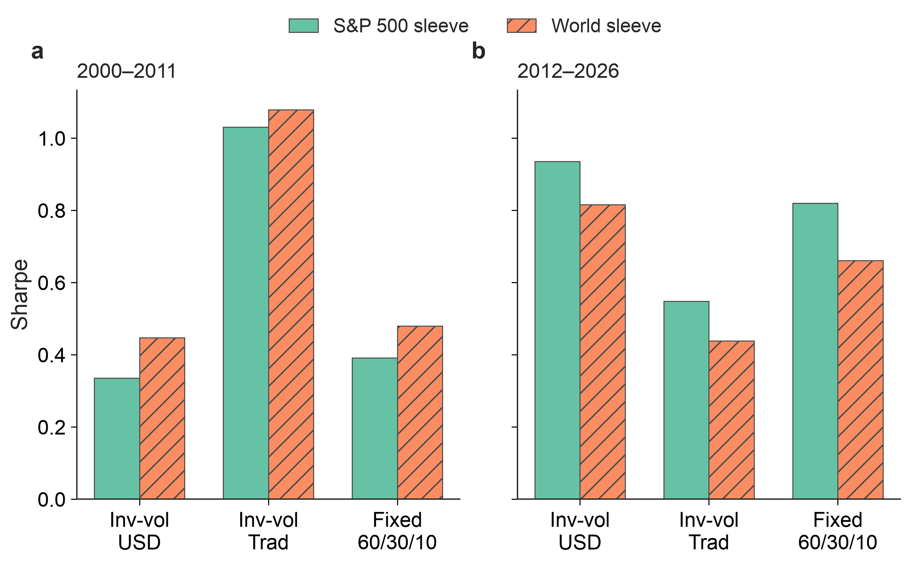

# Inverse-volatility books and a volatility-targeted futures overlay

[](https://github.com/lwang-genomics/inverse-vol-futures-overlay/actions/workflows/ci.yml)


A walk-forward study of long-only **inverse-volatility** portfolios of equities, the US dollar or Treasuries, and
gold (back-adjusted futures and ETFs, 2001–2026), scaled to a **10% volatility target** with a futures overlay. The
focus is on which conclusions survive robustness testing, including the choice of data.

📄 **Full report (PDF):** [`report/inverse_vol_futures_overlay.pdf`](report/inverse_vol_futures_overlay.pdf)

| Claim | Robust? | Evidence |
|---|---|---|
| Inverse-vol books cut drawdowns | **Yes** | −13% (dollar book) and −17% (Treasury book) vs −34% for 60/30/10 and −58% for equities; less loss in every stress episode. |
| One defensive asset is better | **No** | Treasuries over 2001–2026 (Sharpe 0.75 vs 0.68), the dollar since 2022 (1.09 vs 0.27); every bootstrap 95% interval includes zero. |
| At equal risk, inverse-vol beats 60/30/10 | Yes, *with ≈1.8× leverage* | At 10% volatility: 7.9% a year (Treasury book), 7.5% (dollar book), 6.1% (60/30/10), 4.7% (equities). |
| The dollar book depends on gold | **Yes** | Without gold its Sharpe falls to 0.32; the Treasury book keeps 0.60. |
| Unadjusted futures would mislead | **Yes** | On Yahoo's front-month futures the dollar book looked best (0.87 vs 0.63): roll gaps overstate gold and erase the Treasury future's carry. |
| Rebalancing frequency matters | **No** | Monthly to annual moves Sharpe by at most ≈0.06. |
| S&P 500 beats a world-equity sleeve | **Only in 2012–2026** | On 2000–2026 the two give about the same Sharpe inside the dollar book (0.68 vs 0.66). |

---

## Growth and drawdowns

<table>
<tr>
<td width="50%"></td>
<td width="50%"></td>
</tr>
<tr>
<td><sub>Unlevered books (a) and the same books scaled ex ante to 10% volatility (b). Grey: S&P 500 futures alone.</sub></td>
<td><sub>Drawdowns of the unlevered books: the inverse-vol books lost less in every stress episode.</sub></td>
</tr>
</table>

| At 10% volatility (2001–2026) | Inv-vol USD | Inv-vol Treasury | Fixed 60/30/10 | ES only |
|---|---:|---:|---:|---:|
| Annual return | 7.5% | **7.9%** | 6.1% | 4.7% |
| Max drawdown | **−19.5%** | −28.2% | −29.7% | −30.7% |
| Sharpe | 0.69 | **0.72** | 0.54 | 0.42 |
| Average leverage | 1.83× | 1.86× | 1.12× | 0.69× |

## Why it works, and when it doesn't

<table>
<tr>
<td width="50%"></td>
<td width="50%"></td>
</tr>
<tr>
<td><sub>Actual weights: the low-volatility defensive asset takes about half the book.</sub></td>
<td><sub>Rolling correlations: the stock–bond hedge turned positive in 2022; dollar and gold stay negative.</sub></td>
</tr>
<tr>
<td></td>
<td></td>
</tr>
<tr>
<td><sub>Rolling 3-year Sharpe: the lead changes hands; Treasuries led in 2001–2012, the dollar since 2022.</sub></td>
<td><sub>The ETF version (SPY / UUP / GLD) tracks the futures book closely (weekly correlation 0.90).</sub></td>
</tr>
</table>

## Which equity sleeve: S&P 500 or All-World?

<table>
<tr>
<td width="50%"></td>
<td width="50%"></td>
</tr>
<tr>
<td><sub>S&P 500 vs a world-equity proxy since 2000: the world sleeve led until 2011, the S&P 500 since.</sub></td>
<td><sub>Sharpe inside each book, by era: the S&P 500's lead belongs to 2012–2026.</sub></td>
</tr>
</table>

**Follow-up:** Part III of [trend-following-replication](https://github.com/lwang-genomics/trend-following-replication)
adds a trend-following overlay to the Treasury book (back-adjusted futures, 1991–2024). At equal 10% volatility it
raises the Sharpe ratio from 0.66 to 0.99 and cuts the maximum drawdown from −28% to −21%.

---

## Reproduce

```bash
uv sync                  # Python 3.12 environment from uv.lock
uv run ivoverlay         # download prices, run every backtest, write results/ and figures/
uv run ivoverlay-report  # compile the PDF report
uv run pytest            # unit tests on synthetic data (no network)
```

<details>
<summary><b>Method</b></summary>

- **Futures data.** Back-adjusted daily futures (ES, DX, GC, ZN) from the open-source
  [pysystemtrade](https://github.com/pst-group/pysystemtrade) project, pinned to one commit, so roll gaps are not
  counted as returns and carry is included. These free data end in March 2024; each leg then continues with the
  excess return over T-bills of a total-return ETF (SPY, UUP, GLD, IEF), which tracks it with weekly correlation
  0.89–0.98. Yahoo's unadjusted front-month series are kept only to measure their bias.
- **Universe.** Cross-checked against US ETFs (SPY, UUP, GLD, IEF) and UCITS equity ETFs (CSPX, VWRD/VWCE). A 2000–2026 world-equity proxy (50% SPY + 50% VGTSX) is validated
  against ACWI (weekly correlation 0.996).
- **Walk-forward.** Quarter-end rebalancing to inverse-vol weights from the trailing 252 days; weights drift between
  rebalances; each trade pays 10 bp per unit traded.
- **Volatility targeting.** At each rebalance the weights are scaled so that the ex-ante volatility from the trailing
  covariance is 10%, with leverage capped at 3×. No full-sample information is used.
- **Statistics.** Futures Sharpe ratios use rf = 0 (excess returns); ETF and UCITS ones are over 13-week T-bills.
  Correlations use weekly returns, because the futures settle at different times of day.
  Robustness: sub-periods, moving-block bootstrap of Sharpe differences, stress episodes, drop-one-asset tests and
  rebalance-frequency sensitivity.

</details>

<details>
<summary><b>Robustness details</b></summary>

| Sharpe difference (moving-block bootstrap) | Δ Sharpe | 95% interval | Share > 0 |
|---|---:|:---:|---:|
| Inv-vol USD vs Inv-vol Treasury | −0.07 | −0.48 to 0.28 | 30% |
| Inv-vol USD vs Fixed 60/30/10 | 0.07 | −0.29 to 0.40 | 64% |
| Inv-vol Treasury vs Fixed 60/30/10 | 0.13 | −0.17 to 0.49 | 82% |

| Sharpe by sub-period | Inv-vol USD | Inv-vol Treasury | Fixed 60/30/10 |
|---|---:|---:|---:|
| 2001–2012 | 0.35 | **1.04** | 0.43 |
| 2013–2021 | 0.89 | 0.74 | **1.07** |
| 2022–2026 | **1.09** | 0.27 | 0.43 |

| Yahoo front-month vs back-adjusted, 2001–2024 | Sharpe, Yahoo | Sharpe, adjusted |
|---|---:|---:|
| Gold (GC) | 0.54 | 0.41 |
| 10-year Treasury (ZN) | 0.01 | 0.37 |
| Inv-vol USD | **0.87** | 0.69 |
| Inv-vol Treasury | 0.63 | **0.75** |

</details>

<details>
<summary><b>Code and tests</b></summary>

```
src/ivoverlay/
  config.py     instruments, parameters, analysis periods
  data.py       download, cache, return construction, T-bill rate
  backtest.py   walk-forward engine: inverse-vol / fixed weights, drift, costs, vol targeting
  metrics.py    performance metrics, drawdowns, rolling Sharpe
  stats.py      moving-block bootstrap of Sharpe differences
  study.py      the full study, one method per report section
  plots.py      figures: slide versions in figures/, report versions in figures/report/
  report.py     PDF build
```

The tests check the engine against an explicit buy-and-hold holdings simulation, the cost accounting, the
volatility target and leverage cap, and that there is **no look-ahead** (changing every return after a cut-off date
leaves all weights and returns before it unchanged). Prices are cached in `data/` and not committed (Yahoo's terms).

</details>

<details>
<summary><b>Limitations</b></summary>

- Back-adjusted futures end in March 2024; after that each leg uses ETF excess returns (fees make this slightly
  conservative, most for UUP). Roll transaction costs are not modelled.
- Leverage up to 3× is assumed frictionless: margin, financing and liquidity are ignored.
- The sample covers only the final leg of the 2000–02 dot-com crash. No taxes; results are in USD.

</details>

---

Started as a practical question: how to run a long-only multi-asset portfolio and scale it to a target volatility
with a futures overlay, and which parts of the usual backtest story hold up. By Liangxi Wang, computational
scientist (Genomics PhD); independent, not affiliated with any employer. Implemented with AI-assisted coding (Claude
Code); research questions, design decisions, robustness checks and interpretation are my own. Research code, **not
investment advice**. MIT licence.
